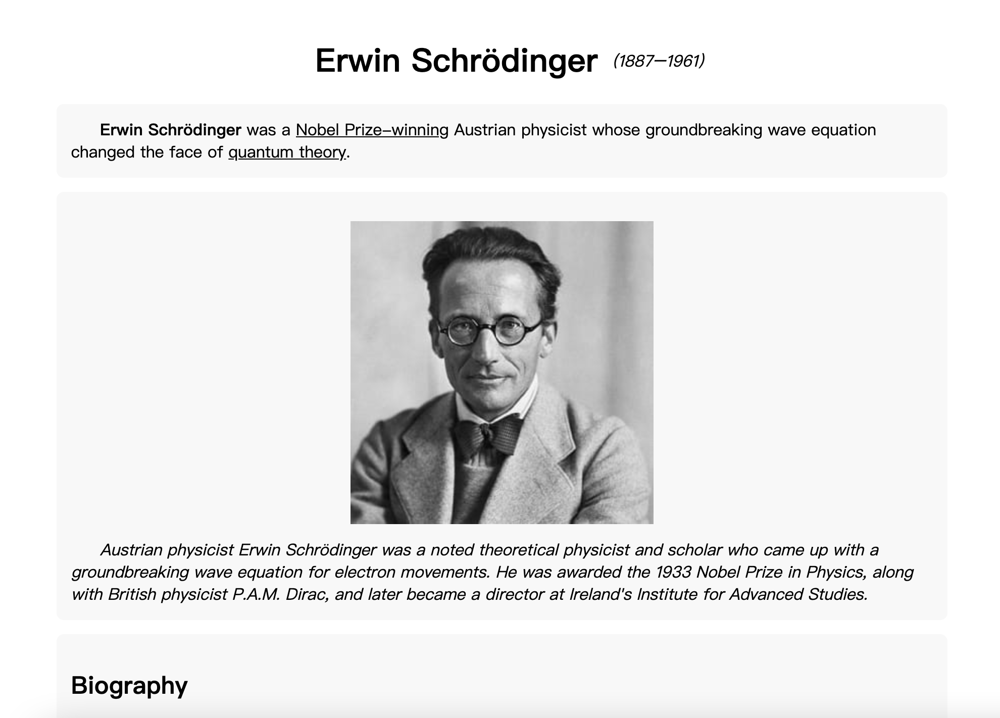
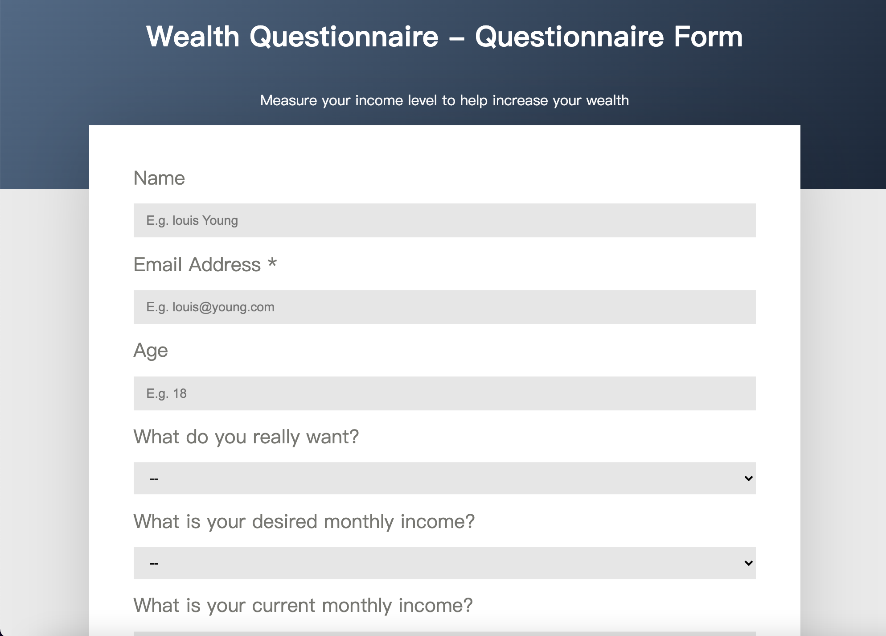
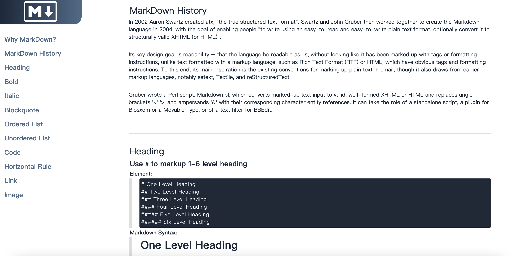

# freeCodeCamp-projects

<!-- Github -->

 
<!-- Gitee -->

##  List
- [Tribute Page - **Erwin Schrödinger**](#tribute-page)
- [Survey Form - **Wealth Questionnaire**](#survey-form)
- [Product Landing Page - **MacBook**](#product-landing-page)
- [Technical Docs Page - **MarkDown**](#technical-docs-page)

## Info
1. Tribute Page
> CodePen Page - https://codepen.io/louisyoungx/pen/bGrXPmd

2. Survey Form
> CodePen Page - https://codepen.io/louisyoungx/pen/bGobbKm

3. Product Landing Page

> CodePen Page - https://codepen.io/louisyoungx/pen/JjrjBBJ

4. Technical Documentation Page

> CodePen Page - https://codepen.io/louisyoungx/pen/oNGggmm

